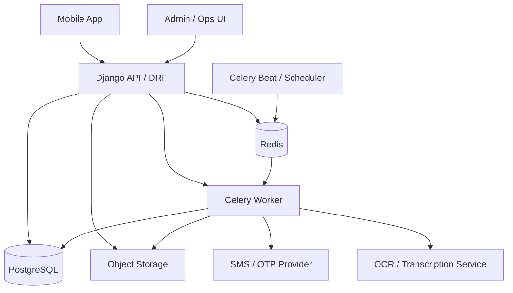

# Kotoku-on-Django: No-Panic Architecture Note

## Overview

Kotoku should start as a modular monolith built on Django and Django REST Framework, with PostgreSQL for transactional data, object storage for evidence files, Redis for queue/cache support, and Celery workers for slow or retryable jobs. This architecture is a practical middle ground because it keeps the system simple for a small team while preserving the ability to scale runtime components independently and extract hotspots later only if needed.[cite:106][cite:111][cite:117]

The core design principle is that Django should own business rules, state transitions, permissions, and auditability, while file-heavy, external, or delayed work should run outside the request-response path. Django's task ecosystem and production deployment patterns support this split, which is especially important for evidence uploads, OTP delivery, PDF generation, and retention jobs.[cite:107][cite:112][cite:113]

## Architecture Summary

| Layer | Recommended tool | Responsibility |
|---|---|---|
| API core | Django + DRF | Agreements, identity, consent, vault, disputes |
| Primary database | PostgreSQL | Relational system of record, state, audit metadata |
| Media storage | S3-compatible object storage | Ghana Card images, agreement photos, audio, PDFs [cite:115] |
| Queue/cache | Redis | Celery broker, short-lived cache, OTP/session support |
| Background execution | Celery workers + scheduler | PDF jobs, reminders, expiry, OCR/transcription orchestration [cite:106][cite:107] |
| Admin operations | Django admin + internal views | Support, audit inspection, failed job review |

## Recommended Runtime Topology

This topology supports independent scaling of API pods, worker pods, and storage-heavy components without breaking the mental simplicity of one core backend codebase.[cite:106][cite:113][cite:117]

## Module Layout

The Django codebase should be organized as a modular monolith with clear domain boundaries. Modular monolith architecture is useful because it preserves development simplicity while reducing the coupling that makes later scaling painful.[cite:111][cite:117]

### Core Django apps

- `accounts` — user profile, authentication state, phone ownership, session context
- `identity` — Ghana Card capture metadata, ID verification status, masked identifier storage
- `agreements` — templates, lifecycle, subject definitions, terms, scenario logic
- `parties` — participants, roles, and per-agreement relationship mapping
- `evidence` — photo/audio/ID metadata, file references, hashes, upload state
- `consent` — OTP workflow, signature phrase events, bilateral confirmation logic
- `vault` — sealed records, retention policy, PDF export references, expiry states
- `disputes` — post-seal annotations, dispute opening, case-pack generation requests
- `audit` — append-only event log, integrity events, actor/action timestamps
- `notifications` — SMS dispatch, reminders, delivery status, retry state
- `jobs` — Celery task declarations and orchestration helpers

### Boundary rules

- Modules may read shared domain primitives, but write operations should go through explicit service methods.
- Sealed agreement mutation should never occur directly through model updates; it should create a new version or append-only event.
- The `audit` module should record every meaningful lifecycle change from day one.

## Data and Storage Strategy

PostgreSQL should be the system of record for agreements, parties, consent, retention state, and audit metadata. Object storage should hold all evidence and generated PDFs because media-heavy systems are operationally cleaner when files are stored outside the application server filesystem.[cite:115][cite:118]

### Store in PostgreSQL

- Agreement records and versions
- Party records
- Subject attributes and terms
- Consent records
- OTP request/verification state
- Vault metadata and retention dates
- Dispute records and annotations
- Audit events
- File metadata, hashes, and storage keys

### Store in object storage

- Ghana Card images
- Evidence photos
- Audio files
- PDF exports and case packs
- Thumbnails and derived assets if needed

## Request Path vs Background Path

The most important no-panic rule is simple: keep user-facing requests fast, and push heavy work to workers. Celery-backed Django setups are commonly used for asynchronous and retryable work, which is important for production resilience.[cite:106][cite:107][cite:112]

### Keep on the request path

- Create draft agreement
- Save agreement step
- Load schema/template
- Request OTP
- Confirm OTP
- Validate readiness to seal
- Mark agreement as sealed
- Fetch vault metadata
- Create export request record

### Move to Celery workers

- Send SMS with retry logic
- Generate PDF export
- Assemble case pack
- Run OCR extraction
- Run audio transcription
- Create thumbnails or compression jobs
- Send retention reminders
- Expire free retention
- Lock unpaid records after grace period

## Key Request Flows

### 1. Draft creation flow

1. Mobile app creates draft through Django API.
2. API stores agreement shell in PostgreSQL.
3. API returns agreement ID and active scenario template.
4. Mobile app saves local draft state for offline resilience.

### 2. Evidence upload flow

1. Mobile app requests upload target from API.
2. API returns controlled upload endpoint or object-storage upload credentials.
3. Mobile app uploads file.
4. API stores file metadata, hash, and ownership reference in PostgreSQL.
5. Optional processing job is queued for OCR/transcription.

### 3. Seal flow

1. Mobile app requests OTP for Party A and Party B.
2. Notification worker sends OTP messages and tracks delivery.
3. Both parties submit OTP confirmations.
4. API validates required fields, evidence, and bilateral consent.
5. Agreement moves to `sealed`.
6. Audit event is written.
7. PDF export task is queued.
8. Vault record updates when PDF is ready.

### 4. Reopen and annotate flow

1. A party requests reopening.
2. API marks agreement `reopen_requested`.
3. Both parties must re-authenticate with fresh OTP before edits are allowed.
4. If both complete re-consent, a new agreement version is created.
5. If one party is unavailable, the system does not mutate the sealed record; it allows a post-seal annotation or dispute record instead.

## Suggested Infrastructure by Stage

| Stage | Deployment posture | Notes |
|---|---|---|
| MVP | 1 Django API service, 1 worker service, managed Postgres, managed Redis, managed object storage | Small-team friendly and production-capable [cite:106][cite:113] |
| Early growth | Multiple API replicas, multiple workers, dedicated scheduler, DB tuning and read replica if needed | Scale API and jobs separately |
| Later growth | Split out hotspots such as notifications, OCR, or document generation only if proven necessary | Preserve Django core for business rules [cite:117] |

## Operational Priorities

### Metrics to watch

- API latency by endpoint
- Worker queue depth
- OTP success and delivery latency
- File upload failure rate
- PDF generation time
- Agreement seal completion rate
- Audit write failure rate
- Retention job backlog

### First dashboards

- Agreements by lifecycle state
- Failed jobs by task type
- Pending OTP confirmations
- Storage usage growth
- Export generation queue
- Daily dispute and annotation volume

## Do This

- Use Django as the core business-rules engine.
- Keep a modular monolith code structure from day one.[cite:111][cite:117]
- Use PostgreSQL for transactional truth.
- Use object storage for all files.[cite:115][cite:118]
- Use Celery for slow, retryable, or scheduled work.[cite:106][cite:107]
- Add append-only audit events early.
- Use Django admin for support and operations.
- Make sealed records immutable and versioned.

## Avoid This

- Do not process PDFs, OCR, or media transforms inside normal API requests.
- Do not store production uploads on local server disk when object storage is available.[cite:115][cite:118]
- Do not let random modules update sealed agreement state directly.
- Do not start with microservices unless a real bottleneck appears.[cite:111][cite:117]
- Do not skip audit logging and try to “add it later.”
- Do not let notifications and OTP logic block the request path.

## Recommended Team Split

### Samuel — backend owner

- Django project structure
- PostgreSQL schema and migrations
- DRF endpoints
- Celery task architecture
- Storage integration
- Audit and lifecycle integrity

### Product/UX owner

- Scenario templates and flow definitions
- API contract alignment with mobile UX
- Review/consent UX
- Vault information design
- Error-state behavior and annotation/reopen policies

### Vibecode AI co-engineering

- Boilerplate acceleration
- API scaffolding
- Test generation
- Migration drafting
- Background job implementation support
- Internal admin productivity tools

## Implementation Starting Point

A sensible first implementation slice is:

1. Authentication and OTP service integration.
2. Agreement draft creation and update API.
3. Evidence upload metadata and object storage integration.
4. Bilateral consent flow.
5. Seal transition plus audit event creation.
6. Background PDF generation and vault record update.

That slice is enough to prove the architecture before adding disputes, reopening, and advanced automation.
